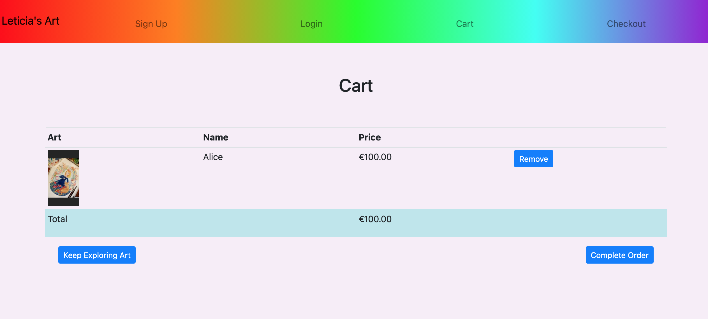
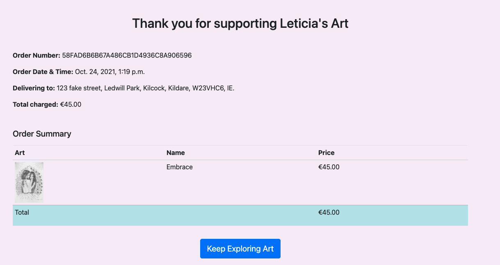
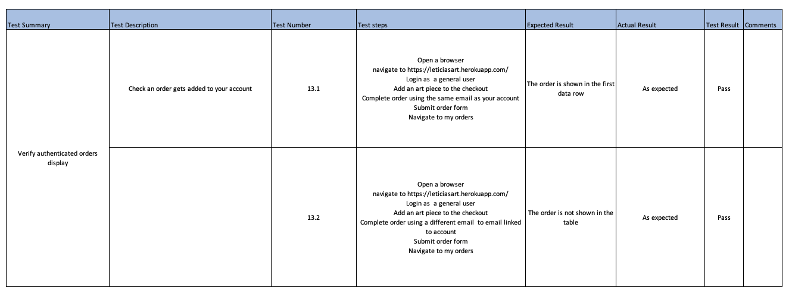

# Leticias Art

## Introduction
Leticias Art is an ecommerce application for a sole artist to sell her work and interact in realtime with potential customers.  

View Live Website [here](https://leticiasart.herokuapp.com/)

Image created using [Am I responsive](http://ami.responsivedesign.is/)

## Table of Contents

- [UX](#ux)
  - [Strategy](#strategy)
    - [User Needs](#user-needs)
        - [As a site user](#as-a-site-user)
        - [As the business owner](#as-the-business-owner)
  - [Scope](#scope)
    - [Features](#features)
    - [Future Features](#future-features)
  - [Structure](#structure)
  - [Skeleton](#skeleton)
    - [Wireframes](#wireframes)
    - [Database Design](#database-design)
  - [Surface](#surface)
    - [Colour Scheme](#colour-scheme)
    - [Typography](#typography)
- [Testing](#testing)
    - [Code Validation](#code-validation)
        - [Html](#html)
          - [Landing Page](#landing-page)
          - [Cart](#cart)
          - [Checkout](#checkout)
          - [Orders](#orders)
          - [Artist Meassages](#artist-messages)
          - [Reply](#reply)
          - [Contact](#contact)
          - [Art Details](#art-details)
        - [CSS](#css)
        - [JavaScript](#javascript)
        - [Python](#python)
    - [Performance Testing](#performance-testing)
    - [User Stories Testing](#user-stories-testing)
      - [Site user](#site-user)
      - [Business owner](#business-owner)
    - [Functionality Testing](#functionality-testing)
    - [Validation Testing](#validation-testing)
    - [Access Testing](#access-testing) 
    - [CRUD Testing](#crud-testing)
    - [Compatibility Testing](#compatibility-testing)
        - [Different devices](#different-devices)
        - [Different Browsers](#different-browsers)
        - [Different Operating Systems](#different-operating-systems)
- [Technologies Used](#technologies-used)
    - [Frameworks and Libraries](#frameworks-and-libraries)
    - [Version Control](#version-control)
    - [Other Programs](#other-programs)
- [Deployment](#deployment)
  - [Run local](#run-local)
  - [Fork repository](#fork-repository)
- [Credits](#credits)
    - [Code](#code)
    - [Content](#content)
    - [Acknowledgements](#acknowledgements)

## UX

The 5 planes of User Experience:

### Strategy
Leticias Art was created with the purpose of providing a platform for the Artist Leticia to advertise and sell her art pieces. 

#### User Needs

##### As a site user
- As a site user, I want to be able to browse art.
- As a site user, I want to be able to quickly know which art pieces are available.
- As a site user, I want to be able to see the price of a piece of art. 
- As a site user, I want to be able to put through an order to buy the piece of art I like.
- As a site user, I want to be able to contact the artist with questions.
- As a site user, I want to be alerted when the artist has replied. 
- As a site user, I want to save my order data for easy access. 

##### As the business owner
- As the business owner, I want to be able to advertise my current art pieces for sale.
- As the business owner, I want to be able to update my current art offering.
- As the business owner, I want to be able to add new art offerings.
- As the business owner, I want to be able to talk in real time with any potential customers who engage with the chat facility.
- As the business owner, I want to see a list of orders in date order.

### Scope

#### Features

The following features are in scope for this project.
- Register Functionality.
  - Validated form to allow user create a profile for accessing the application. 
- Login Functionality.
  - Validated form that checks the users stored details and logs user in only if a successful match. 
- Navigation Menu.
  - A navigation menu will be presented on all pages on application. 
- Responsive Design.
  - Application will be responsive on all device size and browsers.
- CRUD Functionality.
  - Application will enable the functionality to Create, Read, Update and Delete data.
- Database to store app data.
  - Postgres database will be used to store all application data.
- Realtime Chat facility
  - A contact chat facility will be on every page for realtime communication.
- Contact form
  - A Contact form will be available when the artist is offline. 
- Artist Add Art
  - Form to allow the artist to add a new piece of art to sell.
- Artist Edit Art
  - Form to amend an existing art piece.
- Turn on/off messaging functionality
  - A slider that will change the functionality of chat window.
- My Orders
  - A page where logged in users will see their previous orders.
- Orders
  - A page for artist that will show all orders. 
- Detailed Art Page
  - A page that will show more details about an art piece.
- Cart
  - A user will be able to add an art piece to their cart.
  - A user will be able to remove an item from their cart.
- Checkout
  - A user will be able to checkout their order.
- Stripe payments
  - A user will be able to complete checkout with a card payment for their order total using a stripe element.
- Email order confirmation
  - An email will be sent to a user after completing an order with a summary of the order details. 
- 404 Error Page
  - A custom 404 error page if the user navigates to a resource that doesn't exist with a button to return home. 

#### Future Features

I would like to include the following future features.

### Structure

During the planning stage, it was decided that the following pages would be needed to ensure the user needs are meet:

- Landing Page with elements:
  - To tell the visitor what the application is for.
  - To allow user to register.
  - To allow user to login.
  - To allow the user contact the artist.
  - To browse the art pieces.
  - To get more information on art piece.
  - To add art piece to cart.
  - To edit art piece. (artist only)
  - To delete art piece. (artist only)

- An individual page for each art piece with elements:
  - Showing more details for art piece.
  - To add art piece to cart.
  - To allow the user contact the artist.

- Cart Page with elements:
  - To see whats in cart.
  - To edit cart.
  - To navigate away from cart.
  - To checkout order. 
  - To allow the user contact the artist.

- Checkout Page with elements:
  - To see whats in the cart.
  - To see the order total. 
  - To fill in personal and delivery details.
  - To complete a card payment.
  - To tell user to create account to see order details. 

- My Order Page with elements (only for logged in users):
  - To see overview of all orders.
  - To see more details on a specific order
  - To navigate back to art.

- Add Art Page with elements (only for artist):
  - To add details for art piece.
  - To submit the art piece to the database.
  - To cancel the request of adding art piece.
  - To add a photo of art piece. 

- A Messages Page with elements (only for artist):
  - To turn on and off the chat facility.
  - To view chat messages awaiting a reply.
  - To reply to a chat message. 

- An Orders Page with elements (only for artist):
  - To see overview of all orders.
  - To see more details on a specific order

### Skeleton

#### Wireframes

Wireframes for this project were created using Balsamiq and can be viewed at below link.

Link to [Wireframe]()

#### Database Design

This application uses Heroku Postgres to store and retrieve the user data. Postgres is an object-relational database system. This application consists of 7 collections as shown in the schema below.

The users collection is populated when a user successfully registers and is used to verify a user upon login. The Art collection stores the data for the art pieces that appear on the home page. Only a user with staff status can add/edit this collection.

The Messages collection stores the data for any user that engages with the chat functionality present on all pages. The users IP address is added to each message and when removed from the session the assoicated messages are deleted. When the artist replies to a message the IP address of the recieved message is used and the reply recieved field is updated to true.

The Artist collection stores the artist's available status for the chat functionality. This can be updated with a switch on the Messages page by the Artist. 

The Contact collection is used for when the chat facility is not active and the user completes the contact form.

The Order Collection stores the order details when a customer completes checkout. For each order there may be several orderline items, this collection stores data associated with individual cart items and the associated order number. 

### Surface

Leticias Art was designed to be a fun, colorful application to sell art. 

#### Colour Scheme
To reinforce the colourful aspect of art, multiple colours were used throughout the application. The navbar is a gradient of the rainbow colours with a bold purple on the footer. Complimentary colours are used throughout the site to prevent colours clashing. A golden yellow is used on the message alerts and on the footer for the chat functionality. 

#### Typography
Fonts used are Helvetica, Arial and sans-serif. This font was used for clear legibility of text throughout the application. 

## Testing

A summary of testing conducted is shown in the table below. 

### Code Validation

#### Html

Html pages were validated with [W3C Html Checker](https://validator.w3.org/nu/). To obtain the HTML code on live pages, the safari developer tools were used to open the page source html and this was copied and pasted into the text input field on W3C for validation. Pages Sign Up, Login, Checkout Success, Add Art, Art Edit and 404 had no errors or warnings on validation.

##### Landing Page

Errors 
- Element p not allowed as child of element small in this context.
  - This error was present as I had a small element as a parent with a p element as a child. I fixed this error by swaping the roles.
- Unclosed element div.
  - I located the element and closed the corresponding div tag.

##### Cart

The cart page was tested firstly with no items in the cart. Then by adding two items and rechecking the html on Html Checker.

Errors 
- Unclosed element div.
  - This error was due to placing a conditional template literal after the opening of a div, then when condition was false there was only an open div tag. I fixed this by placing the template literal before the opening of the div. 

##### Checkout

Errors
- Duplicate ID submit-button.
  - I had not noticed I had used the same ID on the chat submit button and the checkout submit button. I updated the checkout-button ID to submit-button2 and amended any related files using this value.

##### Orders

Errors 
- Unclosed element div.
  - This error was due to a closing div been outside of a conditional block of html. It was fixed by relocating the closing div within the conditional block.

##### Artist Messages

Errors
- End tag h3 seen, but there were open elements.
  - The above error was due to changing a h3 element to a h5 element and forgetting to change the closing tag. This was updated to ensure both tags have h5.

##### Reply

Errors
- Duplicate IDs
  - Some of the ids for the chat window were also used for the artist reply chat window. I updated the IDs for the artist chat page to remove the duplication.

##### Contact

Errors
- Unclosed element div.
  - I forgot to close the container div. I fixed this an retested. 

##### Art Details

Errors 
- Element p not allowed as child of element small in this context.
  - This error was present as I had a small element as a parent with a p element as a child. I fixed this error by swaping the roles.

All pages now successfully pass through the validator as shown in the image below.

#### CSS

CSS page was validated with [W3C CSS Validator](https://jigsaw.w3.org/css-validator/)

No errors were present.

#### JavaScript

JavaScript files were validated with [JSHint](https://jshint.com/)

The were several warnings as shown below for missing semi-colons, undefined variables and a warning that it is better to use dot notation instead of format ['x']. I fixed the missing semi-colons, defined the variables and updated the notation to dot notion. The code was retested and no warnings are given now.

#### Python

All Python files were validated with [PEP8 online](http://pep8online.com)

The following errors were discovered and fixed to stay PEP8 compliant:
- E302 expected 2 blank line, found 1.
- E713 test for membership should be 'not in'
  - I had a conditional check where the statement was "if not x in y". I fixed the syntax as advised.
- E501 line too long 
  - This occured where my function docstring was longer than 79 characters. I pushed the sentence to the next sentence to stay compliant. 
- E225 missing whitespace around operator
  - This error was due to forgetting to put a whitespace on an assignment operator. 

Errors rectified and files are PEP8 compliant now.

### Performance Testing

Performance was tested using Lighthouse, one of Google's web developer tools. To improve the SEO of the app, I added a meta description. 

For the Landing Page, the best practices score was 93% due to the hero image been displayed with the incorrect aspect ratio for larger devices. I changed the CSS to preserve the aspect ratio of the images using object-fit and object-position properities. This resulted in the best practices score increasing to 100% and improved the layout for user experience.

example output from Lighthouse audit for Landing Page.

The final results for each page are shown in the below table.

### User Stories Testing

The user's needs are met as follows:

#### Site user

> I want to be able to browse art.

Upon entering the site, A user is presented with a section entitled Art Pieces. Here the user can view all art pieces.
 

Each piece has an action button "See More" that gives more details about a particular piece.

 

> I want to be able to quickly know which art pieces are available.

Each art piece has an availability status of "Available" or "Sold Out". If a piece is sold out the Button "Add to cart" is disabled. Once a piece of art has been successfully purchased the status updates from available to Sold Out. 

> I want to be able to see the price of a piece of art. 

The price is shown on each art price below the pieces name.

> I want to be able to put through an order to buy the piece of art I like.

A button "Add to Cart" allows any user to add an available piece of art to their cart. This action redirects the user to the cart where they can see a summary of items added and an action button "Complete Order".

 

If a user chooses to Complete an Order they are redirected to a checkout page with a form for their delivery details and a stripe element to complete payment.  

 

Once submitted, the user gets a confirmation email and is shown a checkout success page with an overview of the order.

 
 

> I want to be able to contact the artist with questions.

Every page has a 'Chat with Leticia' on the footer with a conversation icon. On click, a chat window opens. If the artist is online, a user can message the artist and the artist replies will be added to their chat window. 

 

 

If the artist is offline, a user is given a default message with an option to use a contact form to email the artist.

 

> I want to be alerted when the artist has replied. 

When the artist has replied to your message, the message is added at the bottom of the chat window. If you have the chat window minimised the footer element with the text 'Chat with Leticia' turns green to show a new message. once opened it reverts back to purple. 

 

> I want to save my order data for easy access. 

All logged in users can see the orders associated with their account. In the navigation menu their is an option called My Orders. 

 

The user can click the order number and will see all the details associated with that order. Additionally on the checkout page their is text to alert a user that they can create an account to view their orders.

 

#### Business Owner

> I want to be able to advertise my current art pieces for sale.

Leticias Art landing page showcasts the business owners work and is a platform to sell the pieces to the public. 

> I want to be able to update my current art offering.

When the artist is logged in, she can see an option to 'Edit' on each art piece. On click, this opens a page with the art form prefilled to allow the artist to edit and submit the changes. 

 

 

> I want to be able to add new art offerings.

When the artist is logged in, she has a navigation option of "Add Art".

 

This page presents a form to the artist to fill in the art piece details and an image. Once the form is submitted, the new add piece is added to the landing page. 

 

> I want to be able to talk in real time with any potential customers who engage with the chat facility.

When the Artist logins she has a navigation option of 'Messages'. On this page, the Artist can turn on or off the chat facility using a slider as show in the below image. 

Messages awaiting a reply are shown in a table with the oldest message shown first. The table updates every half minute. An action button of Reply opens a new window with the customers message shown and an input field for the artist to type her reply. The reply message is added to the customers chat window and the customers message is removed from the artists message table.

 

> I want to see a list of orders in date order.

The Artist has a navigation option of Orders. All orders are shown on this page in date order of newest first. The layout is the same as shown previous for the customers orders. 

### Functionality Testing

Test scripts were created for each test case and manual testing was conducted on a laptop and mobile device. 

**Art Piece TC7**

 

**Chat Facility TC8 and TC12**

 
 

**Add Art TC9**
 

**Artist Slider TC10**
 

**Artist see new messages TC11**
 

**Autheniticated users orders TC13**
 

**Logout removes users session and access TC17**
 

**404 Page TC18**
On navigation to a page that doesnt exist, my custom 404 page is displayed as shown below. 
 

**Sign Up TC19**
 

**Login TC20**

 

**Cart TC21**
 

**Checkout TC22**
 

### Validation Testing

**TC15**

All forms were manually tested and the result of the testing are shown in the below table.

### Access Testing

**Access to restricted views TC14**
 

### CRUD Testing

The Create, Read, Update and Delete actions on the database were tested by logging in as an admin at url https://leticiasart.herokuapp.com/admin/ user and checking the result of each CRUD execution in the relevant collection on the database to verify the data has been modified as necessary.

**Create**

 

**Read**

 

**Update**

 

**Delete**

 

### Compatibility Testing

#### Different devices

Using Google Developer tools, I viewed the website on the following devices:
- Galaxy S5
- Pixel 2
- Pixel 2 XL
- iPhone 5/6/7/8 & Plus
- iPhone X
- iPad & iPad Pro
- Surface duo
- Galaxy fold

Based on the user experience, I changed the footer to display diferrently on small and larger devices.On mobile devices the social links are displayed on the left with the copy right text condensed. On larger devices the social links are spread across the available space and the copyright text is centered and contains more words. 

 
 

I added media queries to ensure the user experience is maintained with rotated devices.

#### Different Browsers

I tested the website on:

- Google Chrome
- Safari
- Firefox
- Microsoft Edge
- Internet Explorer

Differences discovered across browsers:

#### Different Operating Systems

The above testing was conducted on below operating systems:

- Windows 8.1
- MacOS Big Sur 11.2.3
- iOS 14.4.2
- Android